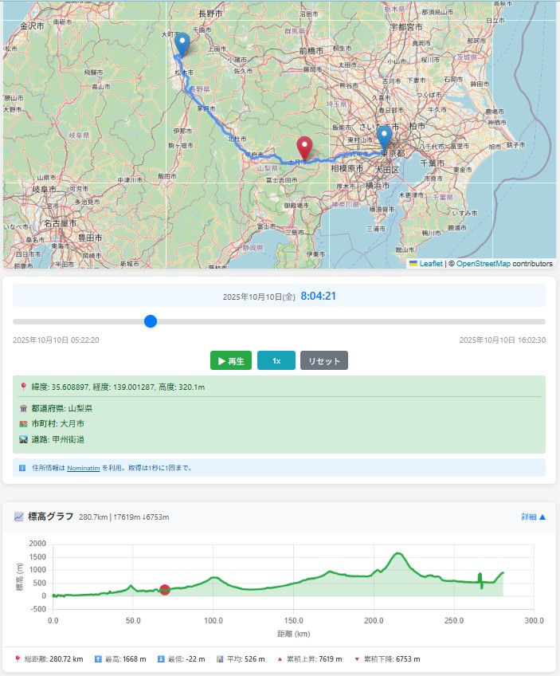

# GPX Map Viewer 🗺️

GPXファイルをアップロードして、地図上でトラックを可視化するWebアプリです。



## ✨ 機能

- 📂 GPXファイルのアップロード（ドラッグ&ドロップ対応）
- 🗺️ OpenStreetMap上にトラックを表示
- ⏱️ タイムスライダーで時間ごとの位置を確認
- ▶️ 再生機能（1x / 2x / 5x / 10x 速度対応）
- 📍 逆ジオコーディングで住所表示（都道府県・市区町村・道路名）
- 📈 標高グラフ（距離・累積標高・現在位置マーカー付き）

## 🚀 クイックスタート

### ローカル開発

```bash
# 依存関係をインストール
uv sync

# 開発サーバーを起動
uv run uvicorn src.main:app --host 0.0.0.0 --port 8000 --reload
```

http://localhost:8000 でアクセスできます。

### Docker（本番環境）

```bash
docker compose -f docker-compose.prod.yml up -d --build
```

http://localhost:8080 でアクセスできます。

## 🛠️ 技術スタック

- **Backend**: FastAPI + Jinja2
- **Frontend**: Leaflet.js + Chart.js
- **Package Manager**: uv
- **Production**: Docker + Nginx + uvicorn
